# Hej, I'm [Tarun](https://tarunb.me) 

Computer Science graduate working across machine learning, research, Linux, and software development.

I'm currently a **Linux Kernel Summer Mentee with the Linux Foundation** and a **research collaborator on an upcoming dataset paper**. My undergraduate research on personalized federated learning for StarCraft II was presented at **IEEE GEM 2026**.

I usually work in Python, with occasional detours into C, Kotlin, JavaScript and whatever else the project needs.

## What I'm doing right now

* Learning the Linux kernel development workflow through the Linux Foundation mentorship program
* Collaborating on a dataset research paper
* Cleaning up old projects and turning the useful ones into proper public repositories
* Building things when an idea seems interesting enough

## Selected work

| Project | What it is |
| --- | --- |
| [FederatedComparison](https://github.com/TarunB-Git/FederatedComparison) | First-author IEEE GEM 2026 research code for centralized and federated StarCraft II action prediction using GRU, LSTM, and Transformer models. |
| [CoachAI](https://github.com/TarunB-Git/coachai-backend) | MediaPipe/OpenCV pose comparison with real-time feedback, analytics, and rendered comparisons. |
| [Note Classification](https://github.com/TarunB-Git/note-processing) | TF-IDF + calibrated linear SVM for classifying notes as questions, tasks, or deadlines. |
| [Supplier Cockpit](https://github.com/TarunB-Git/Supplier-cockpit) | One-day Industrial AI hackathon prototype connecting supplier risk with financial, geopolitical, dependency, and contract signals. |

## Currently building

| Project | Direction |
| --- | --- |
| [NoveList](https://github.com/TarunB-Git/NoveList) | Semantic novel search, recommendations, rankings, personal libraries, and tier lists. |
| [Local Expert](https://github.com/TarunB-Git/LocalExpert) | Local document/folder assistant with citations, cross-document links, generated wikis, and spoiler-aware fiction queries. |
| **SuperCal** | Private local calendar/planner controlled through natural language and voice. |
| **JobFlow** | Job reranking, resume/cover-letter tailoring, anonymization, and application workflow tools. |

## Lab

Smaller projects, old ideas, and things I built to figure something out.
 (Oxford comma ftw.)

| Project | What I was exploring |
| --- | --- |
| [FileDownloader](https://github.com/TarunB-Git/FileDownloader) | Scraping, batch downloads, file renaming, and Tkinter |
| AWS Lambda Image Pipeline | S3-triggered image processing and CloudWatch scaling |
| Twitch Analytics Chatbot | Constrained LLM planning, DuckDB, schema validation, and dual-model comparison |
| [Android experiments](https://github.com/TarunB-Git/AndroidAppJan) | Kotlin, ViewModels, and Android UI development |
| AlphaRoyale | Early experiments toward an agent that can understand and play Clash Royale |
| [Miscellaneous](https://github.com/TarunB-Git/Miscellaneous) | Old websites, scripts, coursework, and assorted experiments |

<!-- 
 ## Stats

 

  
   

 -->
## Elsewhere

[LinkedIn](https://linkedin.com/in/tarun-boddeda) · [Portfolio](https://tarunb.me)

If something here looks interesting, feel free to reach out.

<picture>
  <source
    media="(prefers-color-scheme: dark)"
    srcset="./profile/github-snake-dark.svg"
  />
  <source
    media="(prefers-color-scheme: light)"
    srcset="./profile/github-snake.svg"
  />
  
</picture>
